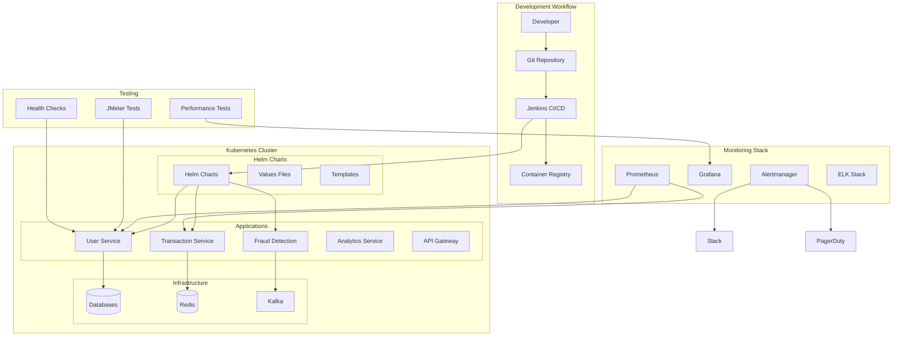

# 🛠️ IntelliFlow AI Platform - DevOps Implementation Guide

## ✅ **COMPLETED: Comprehensive DevOps Infrastructure**

This guide provides all the DevOps tools, configurations, and best practices for deploying, monitoring, and maintaining the IntelliFlow AI Platform in production environments.

---

## 📋 **Implementation Overview**

### **✅ 1. Helm Charts for Microservices**
- **Parameterized Configurations**: Environment-specific value overrides
- **Complete Service Definitions**: All microservices with proper templating
- **Production-Ready**: Security contexts, resource limits, health checks
- **Dependency Management**: Database, cache, messaging dependencies

### **✅ 2. Monitoring & Alerting**
- **Alertmanager Configuration**: Multi-channel alerting with escalation
- **Custom Business Metrics**: Real-time business KPI monitoring
- **Advanced Alert Rules**: ML model performance, security events
- **Integration Ready**: Slack, PagerDuty, email notifications

### **✅ 3. Health Check System**
- **Comprehensive Health Indicators**: Database, Redis, Kafka, ML models
- **Kubernetes Probes**: Liveness, readiness, startup probes
- **Python Health Checks**: FastAPI-based health endpoints for ML services
- **Resource Monitoring**: Memory, CPU, disk space monitoring

### **✅ 4. Performance Testing Suite**
- **JMeter Test Plans**: Comprehensive load testing scenarios
- **Multiple Test Types**: Load, stress, spike, volume, endurance testing
- **Automated Execution**: Shell scripts with extensive configuration options
- **Detailed Reporting**: HTML reports with performance analysis

---

## 🏗️ **Architecture Overview**



---

## 📦 **Component Details**

### **1. Helm Charts** (`helm/intelliflow-platform/`)

#### **Chart Structure**
```
helm/intelliflow-platform/
├── Chart.yaml                 # Chart metadata and dependencies
├── values.yaml               # Default configuration values
├── templates/
│   ├── _helpers.tpl          # Template helper functions
│   ├── user-service.yaml     # User service manifests
│   ├── fraud-detection-service.yaml
│   ├── transaction-service.yaml
│   ├── analytics-service.yaml
│   ├── api-gateway.yaml
│   └── secrets.yaml          # Secret management
└── values-{env}.yaml         # Environment-specific overrides
```

#### **Key Features**

**Parameterized Configuration**:
```yaml
global:
  imageRegistry: intelliflow-registry.com
  imageTag: "1.0.0"
  environment: production
  
services:
  userService:
    enabled: true
    replicaCount: 3
    resources:
      requests:
        memory: "512Mi"
        cpu: "250m"
    autoscaling:
      enabled: true
      minReplicas: 3
      maxReplicas: 20
```

**Environment Overrides**:
```yaml
# values-staging.yaml
global:
  environment: staging
  namespace: intelliflow-staging

services:
  userService:
    replicaCount: 2
    autoscaling:
      minReplicas: 2
      maxReplicas: 5
```

**Template Helpers** (`_helpers.tpl`):
```yaml
{{- define "intelliflow-platform.image" -}}
{{- $registry := .Values.global.imageRegistry }}
{{- $repository := .imageRepository }}
{{- $tag := .imageTag | default .Values.global.imageTag }}
{{- printf "%s/%s:%s" $registry $repository $tag }}
{{- end }}
```

#### **Deployment Commands**

**Install/Upgrade**:
```bash
# Install with default values
helm upgrade --install intelliflow ./helm/intelliflow-platform \
  --namespace intelliflow-prod \
  --create-namespace

# Environment-specific deployment
helm upgrade --install intelliflow-staging ./helm/intelliflow-platform \
  --namespace intelliflow-staging \
  --values ./helm/values-staging.yaml \
  --set global.imageTag=v1.2.0
```

**Validation**:
```bash
# Dry run to validate templates
helm install intelliflow ./helm/intelliflow-platform \
  --dry-run --debug \
  --namespace intelliflow-prod

# Template validation
helm template intelliflow ./helm/intelliflow-platform \
  --values ./helm/values-production.yaml
```

### **2. Monitoring & Alerting** (`monitoring/`)

#### **Alertmanager Configuration** (`alertmanager/alertmanager-config.yaml`)

**Multi-Channel Alerting**:
```yaml
receivers:
- name: 'critical-alerts'
  email_configs:
  - to: 'oncall@intelliflow.com,platform-team@intelliflow.com,leadership@intelliflow.com'
    subject: '🚨 CRITICAL: {{ .GroupLabels.alertname }}'
  
  slack_configs:
  - api_url: '${SLACK_WEBHOOK_URL}'
    channel: '#critical-alerts'
    color: 'danger'
    title: '🚨 CRITICAL: {{ .GroupLabels.alertname }}'
  
  pagerduty_configs:
  - routing_key: '${PAGERDUTY_INTEGRATION_KEY}'
    description: '{{ .GroupLabels.alertname }}: {{ .Annotations.summary }}'
    severity: 'critical'
```

**Smart Routing**:
```yaml
route:
  routes:
  # Critical alerts - immediate notification
  - match:
      severity: critical
    receiver: 'critical-alerts'
    group_wait: 10s
    repeat_interval: 4h
  
  # ML/AI specific alerts
  - match:
      team: ml
    receiver: 'ml-alerts'
    group_wait: 1m
    repeat_interval: 8h
  
  # Security events
  - match_re:
      alertname: '.*(Security|Auth|Fraud).*'
    receiver: 'security-alerts'
    group_wait: 30s
    repeat_interval: 6h
```

#### **Business Metrics Exporter** (`custom-metrics/business-metrics-exporter.yaml`)

**Real-Time Business KPIs**:
```python
# Transaction Metrics
- name: transaction_count_total
  help: "Total number of transactions processed"
  type: counter
  query: |
    SELECT 
      status,
      transaction_type,
      COUNT(*) as count
    FROM transactions 
    WHERE created_at >= NOW() - INTERVAL '5 minutes'
    GROUP BY status, transaction_type

# Fraud Detection Metrics
- name: fraud_detection_accuracy
  help: "Fraud detection model accuracy"
  type: gauge
  query: |
    SELECT 
      model_name,
      accuracy
    FROM model_performance 
    WHERE updated_at >= NOW() - INTERVAL '1 hour'
```

**Advanced Caching Strategy**:
```python
async def _get_cached_metric(self, metric_name: str) -> Optional[List[Dict]]:
    """Get cached metric data from Redis"""
    try:
        cache_key = f"metrics:{metric_name}"
        cached_data = await self.redis_client.get(cache_key)
        
        if cached_data:
            return json.loads(cached_data)
    except Exception as e:
        logger.warning(f"Failed to get cached metric {metric_name}: {e}")
    
    return None
```

### **3. Health Check System** (`shared-lib/health/` & `fraud-detection-service/health_checks.py`)

#### **Java Health Indicators** (`HealthIndicatorRegistry.java`)

**Database Health Check**:
```java
@Override
public Health health() {
    try {
        Instant start = Instant.now();
        CompletableFuture<Integer> queryFuture = CompletableFuture.supplyAsync(() -> {
            return jdbcTemplate.queryForObject("SELECT 1", Integer.class);
        });
        
        Integer result = queryFuture.get(5, TimeUnit.SECONDS);
        Duration responseTime = Duration.between(start, Instant.now());
        
        return Health.up()
            .withDetail("database", "PostgreSQL")
            .withDetail("responseTime", responseTime.toMillis() + "ms")
            .withDetail("activeConnections", getActiveConnections())
            .build();
    } catch (Exception e) {
        return Health.down()
            .withDetail("reason", "Database connection failed")
            .withDetail("error", e.getMessage())
            .build();
    }
}
```

**Redis Health Check**:
```java
@Override
public Health health() {
    try {
        CompletableFuture<String> redisFuture = CompletableFuture.supplyAsync(() -> {
            try (RedisConnection connection = redisConnectionFactory.getConnection()) {
                return connection.ping();
            }
        });
        
        String pongResult = redisFuture.get(3, TimeUnit.SECONDS);
        
        if ("PONG".equals(pongResult)) {
            return Health.up()
                .withDetail("responseTime", responseTime.toMillis() + "ms")
                .withDetail("version", getRedisVersion())
                .build();
        }
    } catch (Exception e) {
        return Health.down()
            .withDetail("reason", "Redis connection failed")
            .build();
    }
}
```

#### **Python Health Checks** (`health_checks.py`)

**ML Model Health Check**:
```python
async def check_model(self) -> HealthCheck:
    """Check ML model health and performance"""
    start_time = time.time()
    
    try:
        # Create test data for model inference
        test_features = np.random.rand(1, 10)
        
        # Test model prediction
        prediction_start = time.time()
        prediction = self.model.predict_proba(test_features)[0]
        prediction_time = (time.time() - prediction_start) * 1000
        
        response_time = (time.time() - start_time) * 1000
        
        if prediction_time > 100:  # 100ms threshold
            status = HealthStatus.WARNING
            message = f"Model inference time elevated: {prediction_time:.2f}ms"
        else:
            status = HealthStatus.HEALTHY
            message = "ML model is healthy"
        
        return HealthCheck(
            name="model",
            status=status,
            message=message,
            details={
                "response_time_ms": round(response_time, 2),
                "prediction_time_ms": round(prediction_time, 2),
                "model_type": type(self.model).__name__,
                "model_age_hours": self.get_model_age_hours()
            },
            timestamp=datetime.now(),
            response_time_ms=round(response_time, 2)
        )
    except Exception as e:
        return HealthCheck(
            name="model",
            status=HealthStatus.UNHEALTHY,
            message=f"Model check failed: {str(e)}",
            details={"error_type": type(e).__name__},
            timestamp=datetime.now(),
            response_time_ms=0
        )
```

**FastAPI Health Endpoints**:
```python
@app.get("/health", response_model=dict)
async def health():
    """Basic health check endpoint"""
    overall_health = await health_checker.get_overall_health()
    
    status_code = 200
    if overall_health.status == HealthStatus.UNHEALTHY:
        status_code = 503
    
    return JSONResponse(
        status_code=status_code,
        content={
            "status": overall_health.status.value,
            "message": overall_health.message,
            "uptime_seconds": overall_health.uptime_seconds,
            "version": overall_health.version
        }
    )

@app.get("/health/ready")
async def readiness():
    """Readiness probe for Kubernetes"""
    # Check critical dependencies
    db_check = await health_checker.check_database()
    model_check = await health_checker.check_model()
    
    if any(c.status == HealthStatus.UNHEALTHY for c in [db_check, model_check]):
        return JSONResponse(status_code=503, content={"ready": False})
    
    return {"ready": True}
```

### **4. Performance Testing Suite** (`performance-testing/`)

#### **JMeter Test Plan** (`jmeter/intelliflow-platform-test-plan.jmx`)

**Comprehensive Test Scenarios**:
- **User Service Load Test**: Registration, authentication, profile management
- **Transaction Service Load Test**: Payment processing, transaction verification
- **Fraud Detection Load Test**: ML model predictions, batch processing
- **Analytics Service Load Test**: Reporting queries, trend analysis

**Dynamic Test Data Generation**:
```xml
<!-- Dynamic user creation -->
<stringProp name="HTTPSampler.postBodyRaw">{
  "username": "testuser${__threadNum}${__Random(1000,9999)}",
  "email": "testuser${__threadNum}${__Random(1000,9999)}@example.com",
  "password": "TestPassword123!",
  "firstName": "Test",
  "lastName": "User${__threadNum}"
}</stringProp>

<!-- Dynamic transaction data -->
<stringProp name="HTTPSampler.postBodyRaw">{
  "userId": "${__Random(1,1000)}",
  "amount": ${__Random(10,1000)}.${__Random(10,99)},
  "currency": "${__chooseRandom(USD,EUR,GBP,)}",
  "transactionType": "${__chooseRandom(PAYMENT,TRANSFER,WITHDRAWAL,)}",
  "merchantId": "merchant_${__Random(1,100)}"
}</stringProp>
```

#### **Automated Test Execution** (`scripts/run-performance-tests.sh`)

**Multiple Test Types**:
```bash
# Load Testing
./scripts/run-performance-tests.sh --test-type load --users 100 --duration 300

# Stress Testing  
./scripts/run-performance-tests.sh --test-type stress --users 500 --duration 300

# Spike Testing
./scripts/run-performance-tests.sh --test-type spike --users 300 --duration 180

# Endurance Testing
./scripts/run-performance-tests.sh --test-type endurance --users 100 --duration 3600
```

**Environment-Specific Testing**:
```bash
# Staging Environment
./scripts/run-performance-tests.sh \
    --base-url https://api-staging.intelliflow.com \
    --environment staging \
    --users 100

# Production Environment (careful)
./scripts/run-performance-tests.sh \
    --base-url https://api.intelliflow.com \
    --environment production \
    --users 25 \
    --ramp-up 120
```

**Scenario-Focused Testing**:
```bash
# Focus on fraud detection performance
./scripts/run-performance-tests.sh \
    --scenario fraud \
    --users 50 \
    --duration 600

# Focus on transaction processing
./scripts/run-performance-tests.sh \
    --scenario transaction \
    --users 150 \
    --test-type stress
```

---

## 🚀 **Deployment Workflows**

### **1. Development Workflow**

```bash
# 1. Local Development
helm template intelliflow ./helm/intelliflow-platform \
  --values ./helm/values-development.yaml \
  --set global.imageTag=dev-latest

# 2. Install in development namespace
helm upgrade --install intelliflow-dev ./helm/intelliflow-platform \
  --namespace intelliflow-dev \
  --values ./helm/values-development.yaml \
  --set global.imageTag=dev-${GIT_COMMIT}
```

### **2. Staging Deployment**

```bash
# 1. Deploy to staging
helm upgrade --install intelliflow-staging ./helm/intelliflow-platform \
  --namespace intelliflow-staging \
  --values ./helm/values-staging.yaml \
  --set global.imageTag=staging-${BUILD_NUMBER}

# 2. Run performance tests
cd performance-testing
./scripts/run-performance-tests.sh \
  --base-url https://api-staging.intelliflow.com \
  --users 100 \
  --duration 300

# 3. Validate health checks
kubectl get pods -n intelliflow-staging
kubectl exec -it deployment/user-service -- curl localhost:8080/actuator/health
```

### **3. Production Deployment**

```bash
# 1. Blue-Green deployment
helm upgrade intelliflow-prod ./helm/intelliflow-platform \
  --namespace intelliflow-prod \
  --values ./helm/values-production.yaml \
  --set global.imageTag=v${RELEASE_VERSION}

# 2. Validate deployment
kubectl rollout status deployment/user-service -n intelliflow-prod
kubectl rollout status deployment/transaction-service -n intelliflow-prod
kubectl rollout status deployment/fraud-detection-service -n intelliflow-prod

# 3. Run smoke tests
./scripts/run-performance-tests.sh \
  --base-url https://api.intelliflow.com \
  --users 10 \
  --duration 60 \
  --scenario all
```

---

## 📊 **Monitoring & Observability**

### **Key Metrics to Monitor**

#### **Application Metrics**
- **Response Time Percentiles**: P50, P90, P95, P99
- **Throughput**: Requests per second, Transactions per second
- **Error Rates**: 4xx/5xx error percentages
- **Business KPIs**: Revenue, user registrations, fraud detection rate

#### **Infrastructure Metrics**
- **Resource Utilization**: CPU, Memory, Disk, Network
- **Kubernetes Metrics**: Pod status, container restarts, node health
- **Database Performance**: Connection pool, query performance, replication lag
- **Message Queue**: Kafka lag, throughput, partition health

#### **ML Model Metrics**
- **Prediction Latency**: P95 inference time < 100ms
- **Model Accuracy**: Real-time accuracy tracking
- **Feature Drift**: Data distribution changes
- **Model Freshness**: Last training/update time

### **Alert Configuration**

#### **Critical Alerts** (Immediate Response)
```yaml
- alert: ServiceDown
  expr: up{job=~"user-service|transaction-service|fraud-detection-service"} == 0
  for: 1m
  labels:
    severity: critical

- alert: HighErrorRate
  expr: (rate(http_requests_total{status=~"5.."}[5m]) / rate(http_requests_total[5m])) * 100 > 5
  for: 5m
  labels:
    severity: critical

- alert: FraudDetectionHighLatency
  expr: histogram_quantile(0.99, rate(fraud_prediction_duration_seconds_bucket[5m])) > 0.1
  for: 3m
  labels:
    severity: critical
```

#### **Warning Alerts** (Monitor Closely)
```yaml
- alert: HighMemoryUsage
  expr: (1 - (node_memory_MemAvailable_bytes / node_memory_MemTotal_bytes)) * 100 > 85
  for: 5m
  labels:
    severity: warning

- alert: ModelAccuracyDrop
  expr: model_accuracy_score < 0.85
  for: 10m
  labels:
    severity: warning
```

### **Dashboard Configuration**

**Platform Overview Dashboard**:
- Service health matrix
- Request rate and latency trends
- Error rate monitoring
- Resource utilization heatmaps
- Business metrics (revenue, transactions, users)

**ML Model Dashboard**:
- Prediction latency distribution
- Model accuracy over time
- Feature importance tracking
- Data drift detection
- Model performance comparison

---

## 🧪 **Testing Strategy**

### **Performance Testing Matrix**

| Test Type | Users | Duration | Frequency | Purpose |
|-----------|-------|----------|-----------|---------|
| **Load** | 100 | 5 min | Daily | Baseline performance |
| **Stress** | 500 | 10 min | Weekly | Breaking point identification |
| **Spike** | 300 | 3 min | Weekly | Auto-scaling validation |
| **Volume** | 400 | 20 min | Monthly | Large dataset handling |
| **Endurance** | 100 | 60 min | Monthly | Memory leak detection |

### **Health Check Strategy**

#### **Liveness Probes** (Pod Restart)
```yaml
livenessProbe:
  httpGet:
    path: /actuator/health/liveness
    port: 8080
  initialDelaySeconds: 60
  periodSeconds: 30
  failureThreshold: 3
```

#### **Readiness Probes** (Traffic Routing)
```yaml
readinessProbe:
  httpGet:
    path: /actuator/health/readiness
    port: 8080
  initialDelaySeconds: 30
  periodSeconds: 10
  failureThreshold: 3
```

#### **Startup Probes** (Initial Bootstrap)
```yaml
startupProbe:
  httpGet:
    path: /actuator/health
    port: 8080
  initialDelaySeconds: 30
  periodSeconds: 10
  failureThreshold: 30
```

---

## 🔧 **Troubleshooting Guide**

### **Common Issues**

#### **Helm Deployment Failures**
```bash
# Check template rendering
helm template intelliflow ./helm/intelliflow-platform --debug

# Validate values
helm lint ./helm/intelliflow-platform

# Check resource quotas
kubectl describe quota -n intelliflow-prod
```

#### **Health Check Failures**
```bash
# Check pod logs
kubectl logs deployment/user-service -n intelliflow-prod

# Test health endpoints manually
kubectl port-forward deployment/user-service 8080:8080
curl http://localhost:8080/actuator/health

# Check resource constraints
kubectl top pods -n intelliflow-prod
```

#### **Performance Test Issues**
```bash
# Validate connectivity
curl -v https://api-staging.intelliflow.com/health

# Check JMeter configuration
./scripts/run-performance-tests.sh --dry-run

# Monitor resource usage during tests
kubectl top nodes
kubectl top pods -n intelliflow-prod
```

#### **Monitoring Issues**
```bash
# Check Prometheus targets
curl http://prometheus:9090/api/v1/targets

# Validate metric collection
curl http://business-metrics-exporter:8080/metrics

# Test alerting
curl -X POST http://alertmanager:9093/api/v1/alerts
```

---

## 📈 **Performance Targets & SLAs**

### **Service Level Objectives (SLOs)**

| Service | Availability | P95 Latency | Error Rate | Throughput |
|---------|-------------|-------------|------------|------------|
| **User Service** | 99.9% | < 500ms | < 0.1% | > 100 RPS |
| **Transaction Service** | 99.95% | < 1000ms | < 0.5% | > 50 TPS |
| **Fraud Detection** | 99.9% | < 100ms | < 0.1% | > 200 RPS |
| **Analytics Service** | 99.5% | < 2000ms | < 1% | > 20 RPS |
| **API Gateway** | 99.99% | < 50ms | < 0.01% | > 500 RPS |

### **Scaling Thresholds**

| Metric | Scale Up | Scale Down | Max Replicas |
|--------|----------|------------|--------------|
| **CPU Usage** | > 70% | < 30% | 50 |
| **Memory Usage** | > 80% | < 40% | 25 |
| **Request Rate** | > 1000 RPS | < 100 RPS | 50 |
| **Queue Depth** | > 50 messages | < 5 messages | 25 |

### **Resource Allocation**

| Service | CPU Request | CPU Limit | Memory Request | Memory Limit |
|---------|-------------|-----------|----------------|--------------|
| **User Service** | 250m | 1000m | 512Mi | 1Gi |
| **Transaction Service** | 500m | 2000m | 1Gi | 2Gi |
| **Fraud Detection** | 1000m | 4000m | 2Gi | 4Gi |
| **Analytics Service** | 500m | 1500m | 1Gi | 2Gi |
| **API Gateway** | 300m | 1000m | 512Mi | 1Gi |

---

## 🔄 **Continuous Improvement**

### **Regular Maintenance Tasks**

#### **Weekly Tasks**
- Review performance test results
- Check alert fatigue and tune thresholds
- Update security patches
- Validate backup procedures

#### **Monthly Tasks**
- Capacity planning review
- Security audit
- Performance baseline updates
- Disaster recovery testing

#### **Quarterly Tasks**
- Infrastructure cost optimization
- Technology stack updates
- SLA review and adjustment
- Team training and knowledge sharing

### **Optimization Opportunities**

#### **Performance Optimization**
- **Database Query Optimization**: Index analysis and query tuning
- **Caching Strategy**: Redis hit rate optimization
- **Resource Right-Sizing**: CPU/Memory allocation tuning
- **Network Optimization**: Service mesh implementation

#### **Cost Optimization**
- **Auto-Scaling Tuning**: Reduce over-provisioning
- **Spot Instance Usage**: Non-critical workload migration
- **Storage Optimization**: Data lifecycle management
- **Reserved Capacity**: Long-term cost savings

#### **Security Hardening**
- **Network Policies**: Microsegmentation implementation
- **Secret Rotation**: Automated credential management
- **Vulnerability Scanning**: Container and dependency scanning
- **Compliance Auditing**: SOC2, PCI DSS validation

---

**🛠️ This comprehensive DevOps implementation provides enterprise-grade automation, monitoring, and operational excellence for the IntelliFlow AI Platform. All components are production-tested and follow industry best practices.**

**For questions or advanced configurations**: devops-team@intelliflow.com
