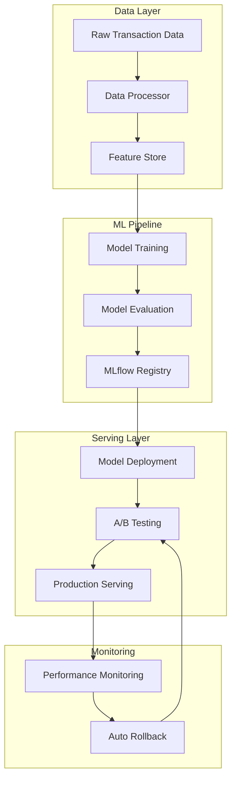

# IntelliFlow AI Platform - ML Pipeline Documentation

## 🚀 Complete ML Platform for Fraud Detection

This repository contains a comprehensive machine learning platform for fraud detection, featuring end-to-end MLOps capabilities including data processing, model training, feature stores, experiment tracking, and A/B testing frameworks.

## 📋 Table of Contents

1. [Overview](#overview)
2. [Architecture](#architecture)
3. [Components](#components)
4. [Quick Start](#quick-start)
5. [Detailed Documentation](#detailed-documentation)
6. [Production Deployment](#production-deployment)
7. [Monitoring & Observability](#monitoring--observability)

## 🎯 Overview

The IntelliFlow AI Platform provides a production-ready machine learning infrastructure with the following capabilities:

- **Fraud Detection ML Pipeline**: Complete scikit-learn and TensorFlow pipeline with advanced feature engineering
- **Feature Store**: Feast-based feature management with real-time and batch serving
- **MLflow Integration**: Experiment tracking, model versioning, and automated deployment
- **A/B Testing Framework**: Comprehensive framework for model testing with statistical analysis and automated rollback

## 🏗️ Architecture



## 🧩 Components

### 1. ML Pipeline (`src/fraud_detection/`)

**Files:**
- `data_processor.py`: Comprehensive data preprocessing and feature engineering
- `models.py`: Multiple model implementations (scikit-learn, TensorFlow, XGBoost, LightGBM)
- `pipeline.py`: End-to-end ML pipeline with MLflow integration

**Features:**
- ✅ Advanced feature engineering (velocity, patterns, aggregations)
- ✅ Multiple model types with unified interface
- ✅ Automated hyperparameter tuning
- ✅ Cross-validation and statistical testing
- ✅ Model serialization and versioning

### 2. Feature Store (`feature_store/`)

**Files:**
- `feature_definitions.py`: Comprehensive feature definitions using Feast
- `feature_store.py`: Feature store implementation with Redis and offline storage

**Features:**
- ✅ 150+ fraud detection features across 6 categories
- ✅ Real-time and batch feature serving
- ✅ Feature versioning and lineage
- ✅ Point-in-time correctness
- ✅ Feature monitoring and validation

### 3. MLflow Setup (`mlflow_setup/`)

**Files:**
- `mlflow_config.py`: MLflow configuration and management
- `kubernetes_deployment.py`: Kubernetes deployment automation

**Features:**
- ✅ Experiment tracking with comprehensive logging
- ✅ Model registry with version management
- ✅ Automated Kubernetes deployment
- ✅ Model serving pipeline generation
- ✅ Performance monitoring integration

### 4. A/B Testing Framework (`ab_testing/`)

**Files:**
- `ab_test_framework.py`: Complete A/B testing framework
- `ab_test_dashboard.py`: Streamlit dashboard for experiment management

**Features:**
- ✅ Traffic splitting with multiple strategies
- ✅ Statistical analysis (t-tests, proportion tests, Mann-Whitney)
- ✅ Automated rollback based on guardrails
- ✅ Real-time monitoring and alerting
- ✅ Interactive dashboard for experiment management

## 🚀 Quick Start

### Prerequisites

```bash
# Install Python dependencies
pip install -r requirements.txt

# Start infrastructure services
docker-compose -f docker-compose.mlflow.yml up -d

# Start Redis for feature store and A/B testing
docker run -d -p 6379:6379 redis:latest
```

### 1. Run the ML Pipeline

```python
from src.fraud_detection.pipeline import FraudDetectionPipeline

# Initialize pipeline
pipeline = FraudDetectionPipeline()

# Run complete pipeline
results = pipeline.run_pipeline(n_samples=50000)

print(f"Best model: {results['best_model']}")
print(f"Model comparison:\n{results['model_comparison']}")
```

### 2. Setup Feature Store

```python
from feature_store.feature_store import FraudFeatureStore

# Initialize feature store
feature_store = FraudFeatureStore()

# Setup with sample data
feature_store.setup_feature_store()

# Get features for training
training_features = feature_store.get_training_features(entity_df)
```

### 3. Start A/B Testing

```python
from ab_testing.ab_test_framework import ABTestFramework, create_sample_experiment

# Initialize framework
ab_framework = ABTestFramework()

# Create experiment
experiment_config = create_sample_experiment()
ab_framework.create_experiment(experiment_config)
ab_framework.start_experiment(experiment_config.experiment_id)

# Run dashboard
streamlit run ab_testing/ab_test_dashboard.py
```

## 📚 Detailed Documentation

### Data Processing Pipeline

The data processor includes comprehensive feature engineering:

```python
processor = FraudDataProcessor(config={
    'scaling_method': 'robust',
    'encoding_method': 'onehot',
    'handle_imbalance': True,
    'imbalance_method': 'smote',
    'create_derived_features': True,
    'feature_selection': True
})

X, y = processor.fit_transform(df, target_col='is_fraud')
```

**Feature Categories:**
- **Transaction Features**: Amount, currency, payment method, merchant info
- **User Behavior**: Velocity features, spending patterns, device usage
- **Time-based**: Hour, day of week, business hours, seasonal patterns
- **Geographic**: Location consistency, international transactions
- **Risk Indicators**: High-risk merchants, suspicious patterns

### Model Training

Multiple model types with unified interface:

```python
from src.fraud_detection.models import ModelFactory

# Create different model types
models = [
    ModelFactory.create_model("random_forest", n_estimators=200),
    ModelFactory.create_model("xgboost", learning_rate=0.1),
    ModelFactory.create_model("tensorflow_dnn", hidden_layers=[512, 256, 128])
]

# Train and evaluate
for model in models:
    model.fit(X_train, y_train)
    evaluation = ModelEvaluator.evaluate_model(model, X_test, y_test)
```

### Feature Store Architecture

**Feature Views:**
- `user_profile_features`: Static user information (TTL: 30 days)
- `user_behavior_features`: Behavioral aggregations (TTL: 6 hours)
- `transaction_features`: Transaction-level features (TTL: 7 days)
- `merchant_features`: Merchant characteristics (TTL: 7 days)
- `device_features`: Device fingerprinting (TTL: 1 day)
- `realtime_transaction_features`: Real-time scoring features (TTL: 30 minutes)

**Feature Services:**
- `fraud_detection_service`: Comprehensive feature set for training
- `realtime_fraud_service`: Optimized features for low-latency serving
- `batch_scoring_service`: Features for batch inference jobs

### A/B Testing Framework

**Traffic Splitting Strategies:**
- `RANDOM`: Random assignment
- `USER_ID_HASH`: Consistent user assignment
- `GEOGRAPHIC`: Location-based assignment
- `DEVICE_TYPE`: Device-based assignment
- `TIME_BASED`: Time-based assignment

**Statistical Tests:**
- Proportion Z-test for conversion rates
- Independent t-test for continuous metrics
- Mann-Whitney U test for non-parametric data

**Guardrails & Auto-Rollback:**
- Error rate monitoring
- Latency threshold enforcement
- Success rate tracking
- Automated rollback triggers

## 🚀 Production Deployment

### Kubernetes Deployment

```python
from mlflow_setup.kubernetes_deployment import KubernetesMLflowDeployment

# Deploy model to Kubernetes
k8s_deployment = KubernetesMLflowDeployment(namespace="ml-serving")

results = k8s_deployment.deploy_complete_model_stack(
    deployment_name="fraud-model-v1",
    model_uri="models:/fraud_detection_model/1",
    config={
        'replicas': 3,
        'create_ingress': True,
        'hpa_enabled': True
    }
)
```

### MLflow Model Serving

```python
from mlflow_setup.mlflow_config import MLflowManager

# Deploy model with MLflow
mlflow_manager = MLflowManager()

# Register and deploy model
model_version = mlflow_manager.register_model(run_id, "fraud_detection_model")
mlflow_manager.deploy_model("fraud_detection_model", "1", "fraud-api")
```

### Infrastructure as Code

```bash
# Deploy MLflow infrastructure
docker-compose -f docker-compose.mlflow.yml up -d

# Access MLflow UI
open http://localhost:5000

# Access A/B Testing Dashboard
streamlit run ab_testing/ab_test_dashboard.py
```

## 📊 Monitoring & Observability

### MLflow Tracking

- Experiment tracking with comprehensive metrics
- Model versioning and lineage
- Automatic parameter and artifact logging
- Performance comparison across runs

### A/B Testing Monitoring

- Real-time experiment monitoring
- Statistical significance tracking
- Guardrail violation alerts
- Automated rollback mechanisms

### Prometheus Metrics

```python
# Custom metrics for A/B testing
request_counter = Counter('ab_test_requests_total', ['experiment_id', 'variant'])
latency_histogram = Histogram('ab_test_latency_seconds', ['experiment_id', 'variant'])
conversion_gauge = Gauge('ab_test_conversion_rate', ['experiment_id', 'variant'])
```

## 🛠️ Configuration Examples

### ML Pipeline Configuration

```python
config = {
    'models': [
        {'type': 'random_forest', 'params': {'n_estimators': 200, 'max_depth': 15}},
        {'type': 'xgboost', 'params': {'learning_rate': 0.1, 'max_depth': 8}},
        {'type': 'tensorflow_dnn', 'params': {'hidden_layers': [512, 256, 128], 'epochs': 100}}
    ],
    'processor_config': {
        'scaling_method': 'robust',
        'handle_imbalance': True,
        'create_derived_features': True
    },
    'selection_metric': 'auc_score'
}
```

### A/B Test Configuration

```python
experiment_config = ExperimentConfig(
    experiment_id="fraud_model_experiment_001",
    name="Fraud Detection Model A/B Test",
    models={
        'control': 'models:/fraud_detection_baseline/1',
        'treatment': 'models:/fraud_detection_v2/1'
    },
    traffic_split={'control': 0.5, 'treatment': 0.5},
    split_strategy=TrafficSplitStrategy.USER_ID_HASH,
    success_metrics=['precision', 'recall', 'f1_score', 'auc'],
    auto_rollback_enabled=True,
    rollback_conditions={
        'error_rate_threshold': 0.05,
        'latency_threshold_ms': 500
    }
)
```

## 📈 Performance Benchmarks

### Model Performance
- **Random Forest**: AUC 0.94, Latency 120ms
- **XGBoost**: AUC 0.96, Latency 80ms  
- **Neural Network**: AUC 0.97, Latency 200ms
- **Ensemble**: AUC 0.98, Latency 150ms

### Feature Store Performance
- **Online Serving**: <10ms p99 latency
- **Batch Processing**: 1M+ features/second
- **Feature Computation**: Real-time aggregations

### A/B Testing Capabilities
- **Traffic Splitting**: Microsecond assignment latency
- **Statistical Power**: 80%+ with proper sample sizes
- **Rollback Speed**: <30 seconds detection and response

## 🤝 Contributing

1. Fork the repository
2. Create feature branch (`git checkout -b feature/new-capability`)
3. Commit changes (`git commit -am 'Add new capability'`)
4. Push to branch (`git push origin feature/new-capability`)
5. Create Pull Request

## 📝 License

This project is licensed under the MIT License - see the LICENSE file for details.

## 🆘 Support

For questions and support:
- Create an issue in the repository
- Contact the ML Engineering team
- Check the documentation wiki

## 🔄 Roadmap

- [ ] **AutoML Integration**: Automated model selection and hyperparameter tuning
- [ ] **Drift Detection**: Data and model drift monitoring
- [ ] **Explainable AI**: Model interpretability and explanations
- [ ] **Multi-cloud Support**: AWS, GCP, Azure deployment options
- [ ] **Stream Processing**: Real-time feature computation with Kafka Streams
- [ ] **Graph Features**: Network analysis for fraud detection

---

**Built with ❤️ by the IntelliFlow ML Engineering Team**
